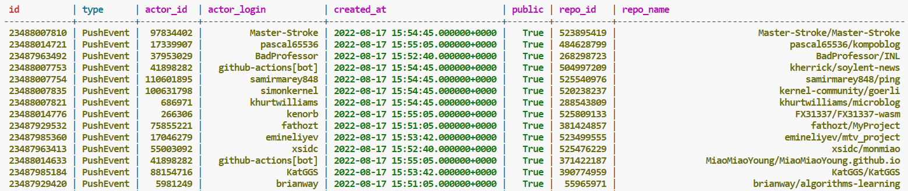

# Documentation
การออกแบบ Data Model ในรูปแบบ distributed database ซึ่งจะเป็นประโยชน์ในแง่ high availability โดยมีจำนวน 1 Schema คือ
 1) events มีทั้งหมด 8 columns ดังนี้
    1.1) id (PK)
    1.2) type (PK)
    1.3) actor_id
    1.4) actor_login
    1.5) repo_id
    1.6) repo_name
    1.7) created_at
    1.8) public
โดยแต่ละ column มีความสัมพันธ์กัน ดังนี้ 
id และ type เป็น Partition key 
create_at เป็น Clustering key
 

## 1. Create table events
```
CREATE TABLE IF NOT EXISTS events
    (
        id text,
        type text,
        actor_id text,
        actor_login text,
        repo_id text,
        repo_name text,
        created_at timestamp,
        public boolean,
        PRIMARY KEY (
            id,
            type
        )
    )
```
## 2. Insert data to events table
```# Insert data into tables here
                query = f"""
                    INSERT INTO events (
                        id,
                        type,
                        actor_id,
                        actor_login,
                        repo_id,
                        repo_name,
                        created_at,
                        public) 
                    VALUES ('{each["id"]}', '{each["type"]}', 
                            '{each["actor"]["id"]}','{each["actor"]["login"]}',
                            '{each["repo"]["id"]}', '{each["repo"]["name"]}', 
                            '{each["created_at"]}',{each["public"]})
                """
                session.execute(query)
```
## 3. Open Cassandra database 
```
cqlsh
```

## 4. Query และจัดการกับข้อมูลผ่าน Casssandra Query Language Shell (CQL)
```
select * from github_events.events;
```
### ตัวอย่างการ Query ข้อมูล
```
cqlsh:github_events> select * from events where type = 'PushEvent' ALLOW FILTERING
```

