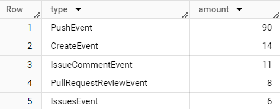

# Building a Data Warehouse
## Instruction
### 1. Create Virtual Environment
```
python -m venv ENV
source ENV/bin/activate
pip install -r requirements.txt
```
### 2. Install packages from requirement.txt
```
pip install -r requirements.txt
```
### 3. Run ETL Script
```
python etl_bigquery.py
```
## Documentation
- update keyfile from path in folder credentials
"[swu-ds525-load-data-to-bigquer.json](credentials/swu-ds525-load-data-to-bigquer-c83cdc04dc74.json)"

- update project_id (name the dataset project from bigquerry)
"data-engineering-on-gcp-414609"

- update schema for the events table
```
     job_config = bigquery.LoadJobConfig(
        skip_leading_rows=1,
        write_disposition=bigquery.WriteDisposition.WRITE_TRUNCATE,
        source_format=bigquery.SourceFormat.CSV,
        schema=[
            bigquery.SchemaField("id", bigquery.SqlTypeNames.STRING),
            bigquery.SchemaField("type", bigquery.SqlTypeNames.STRING),
            bigquery.SchemaField("login", bigquery.SqlTypeNames.STRING),
            bigquery.SchemaField("repo_id", bigquery.SqlTypeNames.STRING),
            bigquery.SchemaField("repo_name", bigquery.SqlTypeNames.STRING),
            bigquery.SchemaField("created_at", bigquery.SqlTypeNames.TIMESTAMP),
            bigquery.SchemaField("public", bigquery.SqlTypeNames.BOOLEAN),
        ],
    )
```
- update table including new column
 ```
 with open("github_events.csv", "w") as csv_file:
        writer = csv.writer(csv_file)
        writer.writerow([
            "id",
            "type",
            "login",
            "repo_id",
            "repo_name",
            "created_at",
            "public"])
```
- update extracting data including new column
``` for datafile in all_files:
            with open(datafile, "r") as f:
                data = json.loads(f.read())
                for each in data:
                    writer.writerow([
                        each["id"], 
                        each["type"],
                        each["actor"]["login"],
                        each["repo"]["id"],
                        each["repo"]["name"],
                        each["created_at"],
                        each["public"]
                        ])
```
## Test the result
- Top 5 type of events on github
```
SELECT type, count(type) amount FROM `data-engineering-on-gcp-414609.github.events`
GROUP BY type
ORDER BY amount DESC
LIMIT 5;
```
